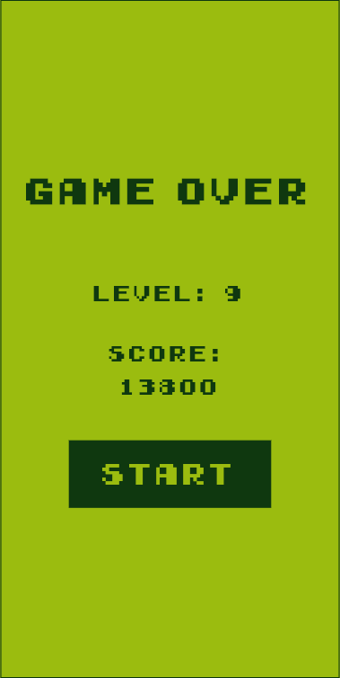
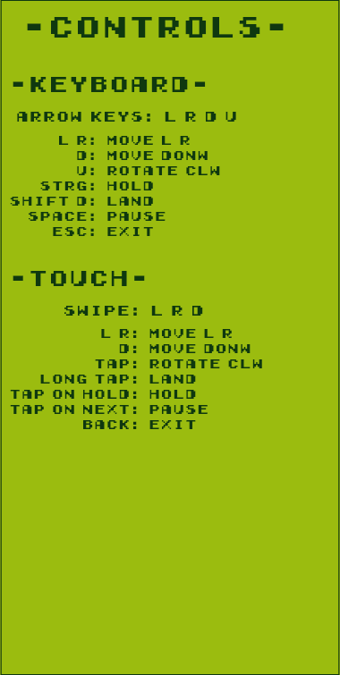

# Flutris
A Retro Tetris Game as Flutter Package





## Behind the scenes
The game is written by using a CustomPainter widget to directly draw to the Canvas pixelwise, so it is more performant than using a lot of widgets for each Tetromino.

The game is capped at 30 frames per seconds, thats more than enough
for a tetris game. That's more energy efficient than running it on high fps just for the sake of having high fps.

## Features

Modern rules:

- It uses a bag of Tetrominos and randomly chooses one out of it until the bag is empty, then the bag gets filled again with one of each of the 7 Tetrominos. This ensures that the same Tetromino can not appear multiple times in sequence


Also:
- Level up by increasing score
- Game Speed inceases on each level up
- Score multiplier based on how many rows have been swept at once
- Shows the next Tetromino at the top right corner
- Hold a Tetromino (held Tetromino is shown in the top left corner)
- Ghost Tetromino that shows where the current Tetromino would land
- Keyboard and Touch controlls are supported

## Controls
Keyboard:
- Arrow key left/right : move the Tetromino left/right one space
- Arrow key down: move the Tetromino down one space
- Arrow key up: rotate the Tetromino clockwise
- Shift + Arrow key down : immediately land the Tetromino at the bottom
- Control: Hold the current Tetromino
- Space: pause game
- Esc: exit

Touch:
- Swipe left/right: move the Tetromino left/right one space
- Swipe down: move the Tetromino down one space
- Tap: rotate the Tetromino clockwise
- Long Tap : immediately land the Tetromino at the bottom
- Tab the Hold Area at the top left corner: Hold the current Tetromino
- Tab the Next Area at the top right corner: pause game
- Back: exit 


## Use this package as a library

### Depend on it

With Flutter:

```yaml
dependencies:
  flutris: ^1.0.0
    path: "path/to/flutris-folder"
```

### Import it
Now in your Dart code, you can use:
```dart
import 'package:flutris/flutris.dart';
```


## Usage
```dart
// Imports
import 'package:flutris/flutris.dart';
import 'package:flutter/material.dart';

// Main
void main() {
  runApp(const MyApp());
}

// MyApp
class MyApp extends StatelessWidget {
  const MyApp({Key? key}) : super(key: key);

  @override
  Widget build(BuildContext context) {
    return MaterialApp(
      title: "Flutter Tetris",
      theme: ThemeData(
        primarySwatch: Colors.blue,
      ),
      home: const MainPage(title: "Flutter Tetris"),
    );
  }
}

// Main Page
class MainPage extends StatefulWidget {
  const MainPage({Key? key, required this.title}) : super(key: key);

  final String title;

  @override
  State<MainPage> createState() => _MainPageState();
}

// Main Page State
class _MainPageState extends State<MainPage> {
  @override
  Widget build(BuildContext context) {
    return Scaffold(
      appBar: AppBar(
        title: Text(widget.title),
        centerTitle: true,
      ),
      body: LayoutBuilder(
        builder: (context, constraints) => SizedBox(
          width: constraints.maxWidth,
          height: constraints.maxHeight,
          // Use Flutris
          // The size determines the size of the game area
          // Here we made it responsive by using a LayoutBuilder
          // and its constraints
          child: Center(child: Flutris(sizeHeight: constraints.maxHeight, muteSound: false, muteMusic: false)),
        ),
      ),
    );
  }
}

```

# Note

You have to call `disposeFlutris` whenever you pop the scope where Flutris is running in. Otherwise the game timer keeps running and will try to call setState on the Flutris widget that is not present in the widget tree anymore. This will cause a crash.

